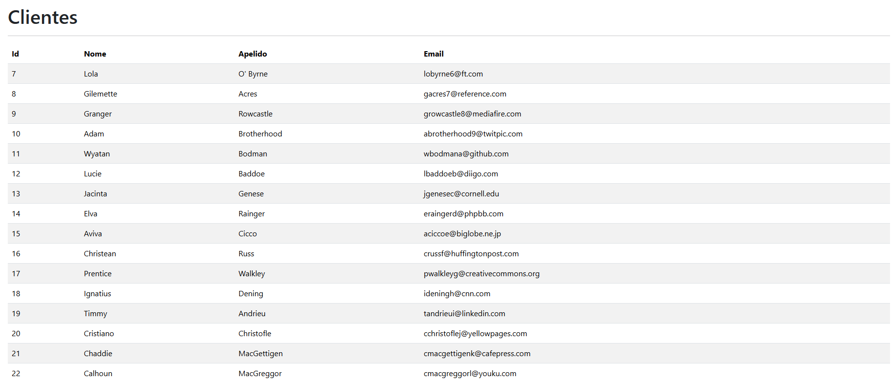

# 🐳 Docker + Nginx + PHP + MySQL

Este projeto utiliza `Docker` com três serviços principais definidos via `docker-compose`:

## 📦 Serviços

```yaml
services:
  # Servidor Nginx
  webserver:
    image: nginx:latest
    container_name: website_nginx
    ports:
      - "8080:80"
    volumes:
      - ./nginx/default.conf:/etc/nginx/conf.d/default.conf

```

```yaml
  # PHP
  php:
    image: php8.3:v1
    container_name: website_php
    volumes:
      - ./php/public:/var/www/html/public

```

```yaml
  # MySQL
  db:
    image: mysql:8.0
    container_name: website_mysql
    ports:
      - "3307:3306"
    restart: unless-stopped
    volumes:
      - ./data:/var/lib/mysql
    environment:
      MYSQL_ROOT_PASSWORD: teste123
      MYSQL_DATABASE: app_database
      MYSQL_USER: user_app_database
      MYSQL_PASSWORD: teste1234
    command: --default-authentication-plugin=mysql_native_password


```


# 🐛 **Problema enfrenteado : DBeaver não conectava ao MySQL no Docker**

## 💻 **Sintomas**
- Erros ao tentar conectar:


Mesmo com configurações corretas de:
- Host: `127.0.0.1`
- Porta: `3306`
- Usuário/senha corretos
- Opções avançadas:
  - `allowPublicKeyRetrieval=true`
  - `useSSL=false`

O banco MySQL no container estava funcionando (teste via `docker exec` funcionava).

## 🔍 Causa
A porta 3306 no seu sistema já estava sendo usada por outro serviço, como:
- Um MySQL instalado localmente no Windows ou WSL
- Outro container ativo

Isso impedia o Docker de mapear corretamente a porta 3306 do container para a 3306 da máquina host.

**Resultado**: O DBeaver tentava se conectar, mas o Docker não estava escutando nessa porta, e a conexão falhava com timeout ou erro de chave pública.

## ✅ Solução
Você alterou o mapeamento da porta no Docker para evitar conflito:

```yaml
# Em docker-compose.yml ou no comando `docker run`
ports:
  - "3307:3306"
```


## Visualização dos dados da tabela `Clients` no DBeaver conectando ao MySQL no Docker.


